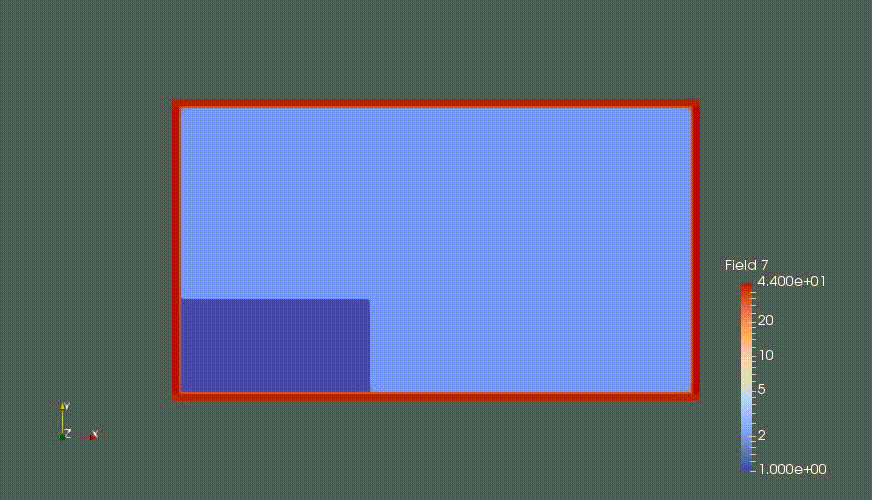

# Foundations of CFD  

This repositary provides technical description of application and importance of CFD in solving classical fluid mechanics problems. 

>Sl.No &nbsp; &nbsp; List of Problems &nbsp; &nbsp; &nbsp; &nbsp; &nbsp; &nbsp;  &nbsp; &nbsp; &nbsp; &nbsp; &nbsp; &nbsp; &nbsp; Code availabe &nbsp; &nbsp; &nbsp; &nbsp;  &nbsp;  Lang. used &nbsp; &nbsp; &nbsp; &nbsp; &nbsp; &nbsp; Contributors	 

>1)  	Lid Driven Cavity Problem      Yes		FORTRAN,MATLAB	 Vijay and Myself 
				     
# Dam Break problem 
 			     
&nbsp; &nbsp; &nbsp; &nbsp; &nbsp; &nbsp; &nbsp; &nbsp; &nbsp; &nbsp; &nbsp; &nbsp; &nbsp; &nbsp; &nbsp; &nbsp; &nbsp; (See SPH repository for more details)			    
      	   

## Important Notes:

* ANSYS Software is used for validating outcomes (Academic license).

Last updated by Yogesh on June, 2018.

	

